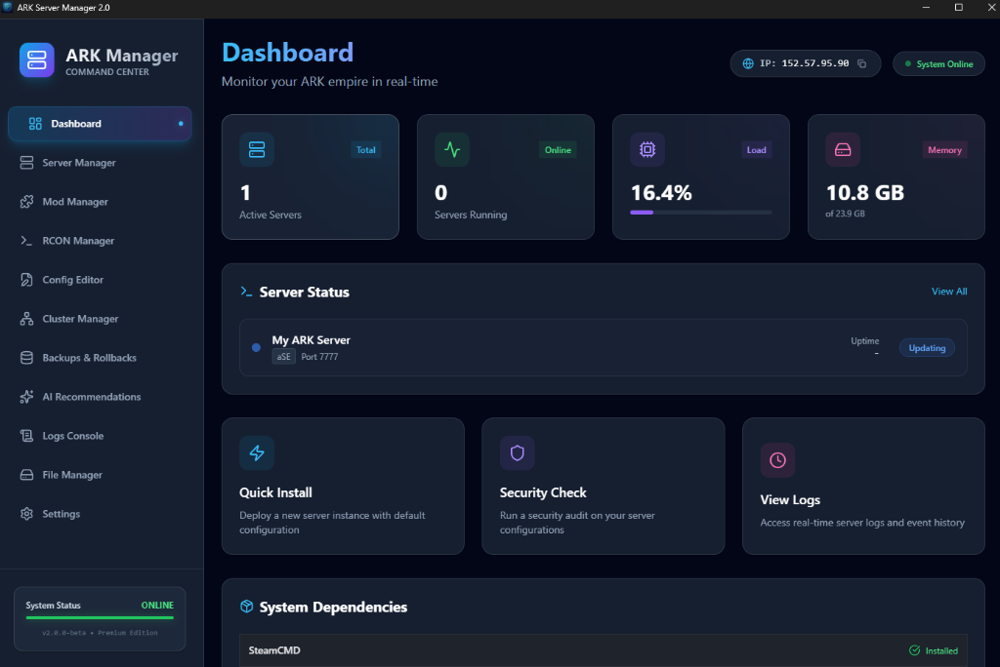
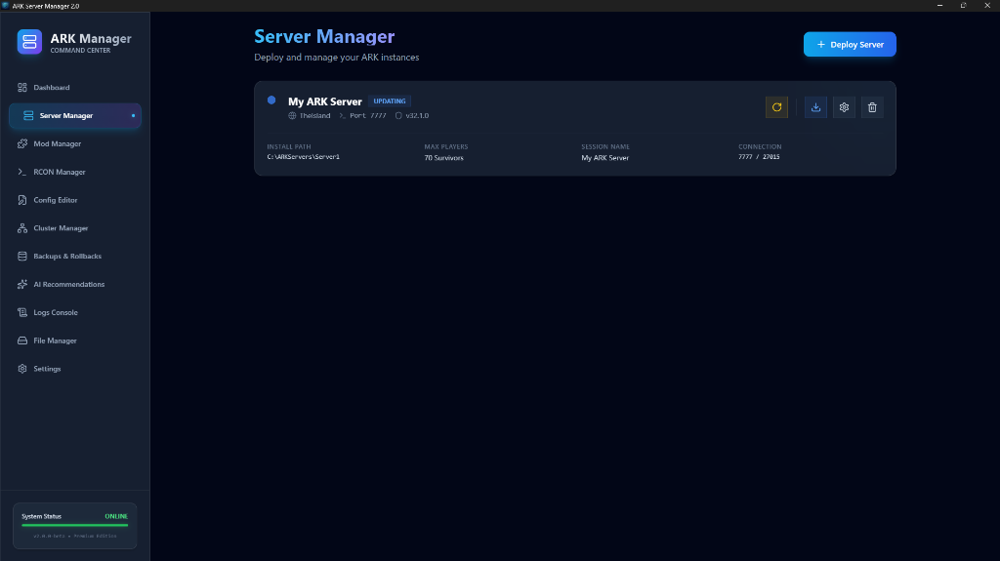
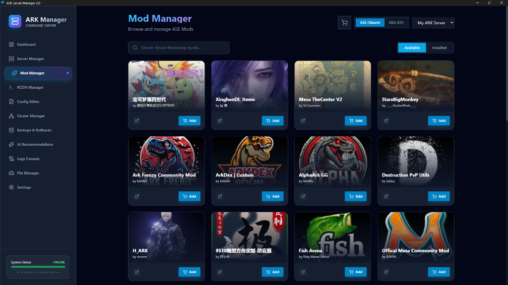
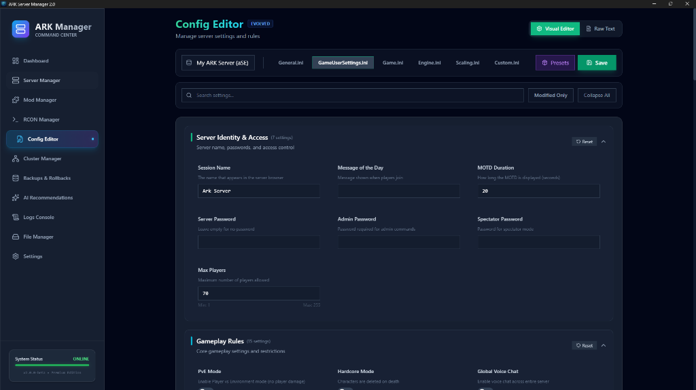
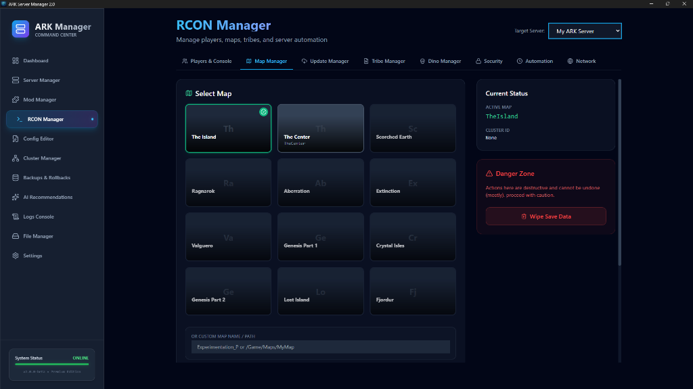

# Ark Server Manager 2.0

A modern, high-performance server management tool for **ARK: Survival Evolved (ASE)** and **ARK: Survival Ascended (ASA)**. Built with [Tauri v2](https://tauri.app) (Rust) and React + Tailwind CSS.

  



## 📸 Gallery

<p align="center">
  
  
</p>
<p align="center">
  
  
</p>

## 🚀 Key Features

### 🎮 Server Management
- **Multi-Game Support**: Seamlessly manage both ASE and ASA servers from a single dashboard.
- **Process Control**: Start, Stop, Restart with real-time status monitoring.
- **SteamCMD Integration**: Automated server installation, updates, and validation.
- **Multi-Server Hosting**: Run unlimited server instances on different ports.

### ⚙️ Advanced Configuration
- **Visual INI Editor**: User-friendly UI for editing `GameUserSettings.ini` and `Game.ini`.
- **Raw Text Mode**: Direct file access for advanced administrators.
- **Map Management**: Easily switch maps and manage launch arguments.
- **Mod Manager**: 
  - Integrated Steam Workshop search (ASE).
  - Integrated CurseForge API support (ASA).
  - Mod installation and active load order management.

### 🛡️ Administration & Security
- **RCON Console**: Direct remote console access for command execution.
- **Player Management**: View online players, kick/ban, and manage whitelists.
- **Tribe Management**: View and manage tribe files (save data).
- **Network Control**: MultiHome binding and port forwarding helper.
- **Security**: BattlEye toggle and IP blacklisting.

### 🤖 Automation
- **Scheduled Tasks**: Cron-based scheduler for Restarts, Backups, Updates, and Broadcasts.
- **Backups**: Automated and manual world save backups with restore functionality.
- **Crash Detection**: (Planned) Auto-restart on server crash.

## 🛠️ Tech Stack

- **Frontend**: React 18, Tailwind CSS, Lucide Icons, Shadcn-like UI components.
- **Backend**: Rust (Tauri), SQLite, Rocket/Reqwest (Networking).
- **Storage**: Local SQLite database (`ark_manager_v2.db`) and local filesystem.

## 📦 Installation & Development

### Prerequisites
- [Node.js](https://nodejs.org/) (v18+)
- [Rust](https://rustup.rs/) (Stable)
- MSVC C++ Build Tools (Windows) - Only for development

### End Users (Automatic Setup)
**Download** the latest installer from [Releases](https://github.com/SANJAY-SM96/Ark-server-manager-2.0/releases)

✅ **Zero Manual Configuration Required!**
- Visual C++ Redistributables install automatically during setup
- SteamCMD downloads automatically on first launch
- Windows Firewall rules configured automatically
- Ready to use in minutes!

### Developers (Manual Setup)
```bash
# 1. Clone the repository
git clone https://github.com/SANJAY-SM96/Ark-server-manager-2.0.git
cd Ark-server-manager-2.0

# 2. Install frontend dependencies
npm install

# 3. Run in Development Mode
npm run tauri dev
```

### Building for Production
```bash
npm run tauri build
```
The executable will be located in `src-tauri/target/release/bundle/nsis/`.

## 🔒 Data Privacy & Isolation

- **100% Local**: All data stored on your computer only
- **No Cloud Sync**: No remote servers or data collection
- **Per-User Isolation**: Each Windows user gets their own separate installation
- **No Telemetry**: Zero tracking or analytics
- **Offline Capable**: Works completely offline after initial setup

## 📁 Project Structure
- `src/`: React frontend code (Pages, Components, Stores).
- `src-tauri/src/`: Rust backend code.
  - `commands/`: IPC command handlers exposed to frontend.
  - `services/`: Business logic (SteamCMD, Process Management, etc.).
  - `db/`: Database schema and connection logic.

## 📝 License
MIT License.
